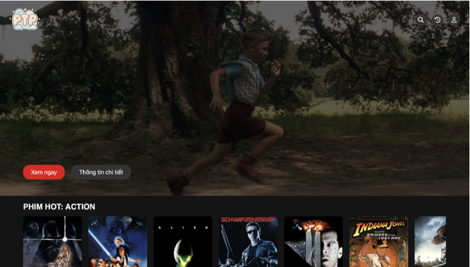

# Movie Recommendation System

This project is developed by three students from the **School of Information and Technology** - **Hanoi University of Science and Technology**:
- **Nguyễn Hoàng Phương** ([@fuongfotfet](https://github.com/fuongfotfet)) – [phuong.nh225070@sis.hust.edu.vn](mailto:phuong.nh225070@sis.hust.edu.vn)
- **Phạm Hùng Phong** ([@phong151104](https://github.com/phong151104)) – [phong.ph225060@sis.hust.edu.vn](mailto:phong.ph225060@sis.hust.edu.vn)
- **Nguyễn Quốc Thái** ([@thaisvsthinhs](https://github.com/thaisvsthinhs)) – [thai.nq225083@sis.hust.edu.vn](mailto:thai.nq225083@sis.hust.edu.vn)

We combine three main approaches to build a comprehensive Movie Recommendation System:
1. **Neural Collaborative Filtering (NCF)**
2. **KNN + FAISS (Approximate Nearest Neighbors)**
3. **Content-based Filtering**

The goal is to deliver accurate and efficient movie suggestions based on user preferences, user–item ratings, and movie metadata.

---

## Table of Contents
1. [Overview](#overview)
2. [Methods](#methods)
    - [1. Neural Collaborative Filtering (NCF)](#1-neural-collaborative-filtering-ncf)
    - [2. KNN + FAISS (Approximate-Nearest-Neighbors)](#2-knn--faiss-approximate-nearest-neighbors)
    - [3. Content-based Filtering](#3-content-based-filtering)
3. [Requirements](#requirements)
4. [Quick Start](#quick-start)
5. [Prototype UI](#prototype-ui)
    - [1. Select Genres](#1-select-genres)
    - [2. Select Movie](#2-select-movie)
    - [3. Recommendations](#3-recommendations)
6. [Contributing](#contributing)
7. [Contact](#contact)

---

## Overview
This Movie Recommendation System aims to:
- **Recommend movies** based on users’ past interactions, ratings, and genres of interest.
- **Leverage multiple recommendation algorithms** to handle different scenarios for optimal speed and accuracy.
- **Provide a simple web-based prototype** allowing users to select genres, pick a movie, and receive suggestions in real time.

---

## Methods

### 1. Neural Collaborative Filtering (NCF)
- **Idea**: Utilize neural networks (e.g., MLP layers) to learn latent factors for both users and items, combining them to predict user preferences.
- **Advantages**:
    - Captures complex user–item interactions in a non-linear manner.
    - Potentially more accurate than traditional MF-based approaches if trained with sufficient data.

### 2. KNN + FAISS (Approximate Nearest Neighbors)
- **Idea**: Represent movies (or users) as vectors in a feature space; then find the nearest neighbors using **FAISS** to accelerate similarity search with large-scale datasets.
- **Advantages**:
    - Straightforward to implement.
    - **FAISS** significantly speeds up similarity queries in high-dimensional spaces.

### 3. Content-based Filtering
- **Idea**: Compare movie metadata (genre, director, cast, plot, etc.) to make recommendations based on similarity of content.
- **Advantages**:
    - Works well when user behavior data is limited.
    - Explanations are more intuitive (e.g., “Because you liked this comedy with actor XYZ…”).

---

## Requirements
Make sure you have **Python 3.7+** (or above). Install dependencies:

```bash
pip install numpy pandas scikit-learn faiss tensorflow
```
You may have to install the movies metadata from TMDB too :b
## Quick Start

1. **Clone or Download the Repository**

   ```bash
   git clone https://github.com/fuongfotfet/Movie-Recommendation-System.git
   cd Movie-Recommendation-System
   ```

2. **Run the Web Prototype**

    - Change into the `web/main` directory:

      ```bash
      cd web/main
      ```

    - Start the Flask (or Python) application:

      ```bash
      python app.py
      ```

   By default, Flask will run on `http://127.0.0.1:5000/` (or a similar local URL).

3. **Open the Frontend**

    - Navigate to `web/main/frontend` and open `select_genres.html` in your browser.
    - Alternatively, use the route configured in `app.py` to access the page.

---

***Note: The prototype only using Content-based and FAISS model***
## Prototype UI

### 1. Select Genres


Users can pick one or multiple genres (e.g., Action, Comedy, Drama) to personalize recommendations.

### 2. Select Movie


Users can type or select a movie title from a dropdown or list to trigger the recommendation engine.

### 3. Recommendations
![Movie Recommendations UI]Movie-Recommendation-System-main/document/recommendations.png)

The system will generate a list of recommended movies based on KNN+FAISS, or Content-based approaches.

---

## Contributing

Feel free to contribute by submitting a [Pull Request](../../pulls) or by opening an [Issue](../../issues). We welcome any suggestions on:
- Improving model performance
- Optimizing the code
- Enhancing the UI design

Please follow the standard GitHub workflow for making contributions.

---

## Contact
**Authors**:
- [Nguyễn Hoàng Phương](mailto:phuong.nh225070@sis.hust.edu.vn)
- [Phạm Hùng Phong](mailto:phong.ph225060@sis.hust.edu.vn)
- [Nguyễn Quốc Thái](mailto:thai.nq225083@sis.hust.edu.vn)

All are students at the **School of Information and Communication Technology** - **Hanoi University of Science and Technology**.

For further inquiries or suggestions, contact us via email or create an [Issue](../../issues).

---

**Thank you** for using and exploring this Movie Recommendation System! We hope you find it useful and look forward to your feedback.
